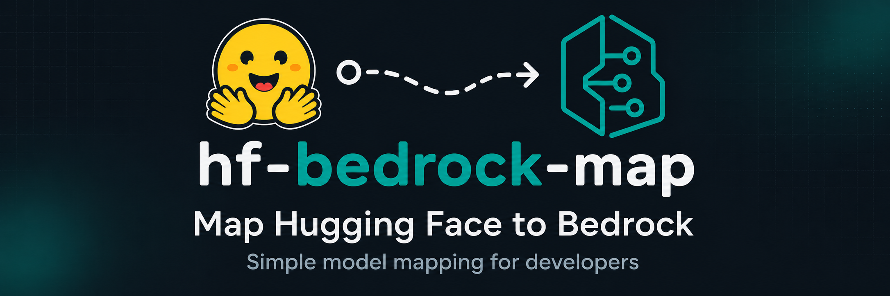

# hf-bedrock-map

<p align="center">
  <a href="https://scttfrdmn.github.io/hf-bedrock-map/">
    
  </a>
</p>

A daily-refreshed, publicly browsable mapping between Hugging Face model repos
and the models **Amazon Bedrock can serve right now**.

[](https://github.com/scttfrdmn/hf-bedrock-map/actions/workflows/refresh.yml)
[](https://scttfrdmn.github.io/hf-bedrock-map/)
[](go.mod)
[](LICENSE)
-232F3E?logo=amazon-aws&logoColor=white)

**Links**

- 🔎 **Search UI** — <https://scttfrdmn.github.io/hf-bedrock-map/>
- 🔌 **Reverse-lookup API** — [`docs/API.md`](docs/API.md)
  · [`/api/v1/index.json`](https://scttfrdmn.github.io/hf-bedrock-map/api/v1/index.json)
- 📇 **Data** — [`mapping.json`](https://scttfrdmn.github.io/hf-bedrock-map/mapping.json)
  ([schema](#data-schema-mappingjson))
- 🛠 **Handoff notes** — [`CLAUDE.md`](CLAUDE.md)

## Why

Neither AWS nor Hugging Face publishes a mapping between the two. If a team is
spinning up their own GPUs to self-host an open-weight model that Bedrock
already serves on demand, they're paying for infrastructure they may not need.
This tool answers the question directly: **"I'm self-hosting HF repo X — is it
already available on Bedrock?"**

Bedrock's catalog is bounded (a few hundred entries), so the tool enumerates it
on a schedule and resolves each entry to the HF repo it corresponds to. The
reverse lookup (HF id → Bedrock) falls out of the same table.

**Region scope: US only.** The Bedrock catalog varies by region and no single
region is a superset — e.g. `qwen.qwen3-coder-next` is us-east-1-only, and the
four US regions together serve ~139 native models vs 114 in us-west-2 alone. So
this deployment **unions the four US regions** (us-east-1, us-east-2, us-west-1,
us-west-2) and records which of them serve each model. Non-US regions are out of
scope here; to cover others, fork and set `BEDROCK_REGIONS`.

## Scope: what Bedrock can serve

The mapping covers exactly the models invocable from Bedrock today:

- **Native serverless foundation models** — `bedrock:ListFoundationModels`
  (Claude, Nova, Llama, Qwen, DeepSeek, Mistral, gpt-oss, …).
- **Bedrock Marketplace** — the subset of the SageMaker JumpStart public hub
  flagged `@capability:bedrock_console`. The ~550 JumpStart-only models (classic
  SageMaker recipes like catboost/autogluon) that cannot run on Bedrock are
  deliberately excluded.

## Architecture

```
GitHub Actions (cron, OIDC role, read-only AWS creds)
        │
        ▼
cmd/refresh ── for each US region: bedrock:ListFoundationModels
   │                                sagemaker:ListHubContents / DescribeHubContent
   │        ── unions the catalogs, records serving regions per model
   │        ── scrapes AWS model-card doc pages   (authoritative EULA links)
   │        ── validates candidates via Hugging Face Hub API
   ▼
docs/mapping.json ──(git commit)──▶ GitHub Pages ──▶ docs/index.html
                                                     (client-side search,
                                                      no backend at request time)
```

No long-lived AWS credentials anywhere. No S3. The AWS OIDC role can only read
Bedrock/SageMaker catalog metadata — it has no write permission of any kind.

### How native FMs are resolved

The AWS *API* exposes no HF link for native foundation models, so the tool
draws on two external, authoritative-where-possible sources:

1. **AWS model-card doc pages.** Every Bedrock model has a doc card whose "End
   User License Agreements and Terms of Use" link is a provenance pointer. For
   many open-weight models it links **directly to the Hugging Face repo AWS
   serves** (exact variant included) → `confirmed`.
2. **Hugging Face Hub API.** When the card links to a provider's own license
   instead (llama.com, nvidia.com, …), the tool searches that provider's HF org
   and confirms a candidate repo exists → `validated`, or flags `ambiguous`
   when several real variants can't be told apart from the modelId.

A small `cmd/refresh/native_overrides.json` handles the genuinely
un-derivable cases (e.g. Llama 4's `16E`/`128E` expert counts), each verified
by hand.

## Reverse-lookup API (for integrations)

A static, no-backend API is published alongside the search page for apps that
need to ask programmatically "is HF repo X on Bedrock?" — e.g. a job that
detects a model being loaded onto a GPU and checks whether Bedrock already
serves it.

- **Per-model:** `GET /api/v1/hf/{org}/{repo}.json` → `200` with details, `404`
  if not served.
- **Bulk:** `GET /api/v1/index.json` → the whole reverse map, for offline/batch
  lookups.

Both are regenerated on every refresh and served with permissive CORS. Full
schema and copy-pasteable curl/Python/JS clients: [`docs/API.md`](docs/API.md).

## Confidence levels

Not all rows carry the same evidentiary weight:

| Confidence | Meaning |
|---|---|
| `confirmed` | HF repo id from an authoritative AWS source: a JumpStart `HubContentDocument.Url`, a model-card EULA link pointing at huggingface.co, or a hand-verified override. Trust this. |
| `validated` | No direct AWS link, but the candidate HF repo was confirmed to **exist** under the provider's own HF org via the HF API. High confidence, not AWS-stated. |
| `ambiguous` | Open-weight and on HF, but multiple real variants exist (e.g. `-Instruct` vs `-Thinking`) and the Bedrock modelId can't say which is served. Candidates listed in `evidence`. |
| `proprietary` | Closed-weight provider (Amazon, Anthropic, Cohere, Stability, …). No HF equivalent by design. |
| `unresolved` | On Bedrock, but no HF repo determinable from available metadata. |

Every row records an `evidence` string so any classification can be audited
without re-running the tool.

## Data schema (`mapping.json`)

The full forward table. Top-level:

```jsonc
{
  "generatedAt": "2026-07-16T00:25:52Z",   // RFC3339 UTC
  "regions": ["us-east-1","us-east-2","us-west-1","us-west-2"],
  "counts": { "total": 291, "confirmed": 130, "validated": 17,
              "ambiguous": 8, "proprietary": 133, "unresolved": 3 },
  "entries": [ /* Entry objects, sorted by catalog then bedrockModelId */ ]
}
```

Each `Entry`:

| Field | Type | Notes |
|---|---|---|
| `bedrockModelId` | string | Bedrock modelId (native FM) or hub content name (marketplace). |
| `catalog` | string | `foundation-model` or `marketplace`. |
| `provider` | string | Provider name, when known. |
| `modelName` | string | Human-readable name, when known. |
| `hfId` | string | Hugging Face `org/repo`; omitted for proprietary/unresolved. |
| `hfUrl` | string | `https://huggingface.co/{hfId}`; omitted when no `hfId`. |
| `confidence` | string | One of the five levels above. |
| `regions` | string[] | US regions (of those queried) that serve this model. |
| `evidence` | string | Where `hfId`/`confidence` came from — for auditing. |

The **reverse** (HF-id-keyed) view for integrations is the API in
[`docs/API.md`](docs/API.md); it omits proprietary/unresolved rows since they
carry no HF id.

## Setup (one-time)

1. `infra/setup.sh` — creates the GitHub OIDC provider (if not already present)
   and a repo-scoped IAM role with read-only Bedrock/SageMaker permissions. Edit
   `GITHUB_ORG`/`GITHUB_REPO` at the top first.
2. Set the printed role ARN as a repo Variable: `HF_BEDROCK_MAP_ROLE_ARN`.
3. (Recommended) set an HF read token as a repo Secret `HF_TOKEN` so gated
   provider repos (meta-llama, mistralai) resolve during refresh. Optional —
   the tool degrades gracefully without it.
4. Repo Settings → Pages → source = "Deploy from a branch" → `main` / `/docs`.
5. Trigger `.github/workflows/refresh.yml` manually once (`workflow_dispatch`)
   to populate `docs/mapping.json`; it then runs daily at 06:00 UTC.

## Local dev

```
go mod tidy
export HF_TOKEN=<hf_read_token>          # optional; improves native resolution
AWS_PROFILE=<profile-with-read-access> go run ./cmd/refresh
```

Queries the four US regions by default. Override with `BEDROCK_REGIONS`
(comma-separated) if you've forked for another geography:

```
BEDROCK_REGIONS="eu-west-1,eu-central-1" go run ./cmd/refresh
```

If your profile authenticates via a non-standard mechanism the Go SDK doesn't
read directly (e.g. a custom SSO login), bridge the credentials first:

```
eval "$(aws configure export-credentials --profile <profile> --format env)"
```

Writes `mapping.json` to the repo root (gitignored) so you can inspect output
without touching `docs/`. Run `go test ./...` for the resolver unit tests.

## License

Apache 2.0 — see `LICENSE`.
